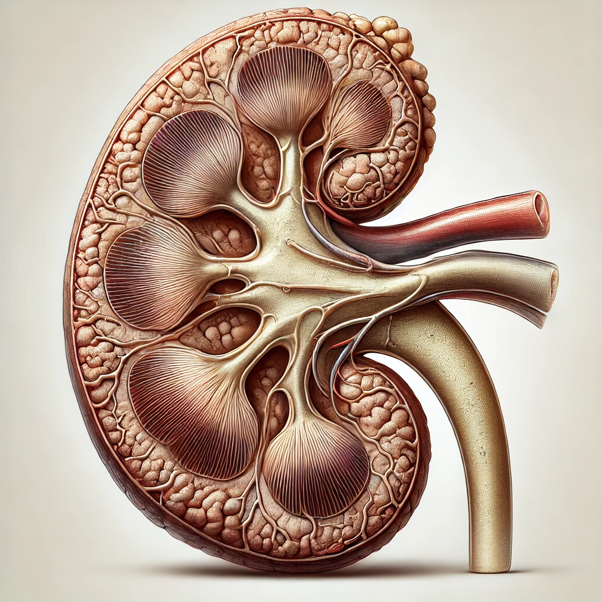

# CKD Detection Project

## Overview

This project uses machine learning to predict the likelihood of Chronic Kidney Disease (CKD) based on clinical and laboratory features. The dataset includes critical health metrics like blood pressure, glucose levels, and hemoglobin to identify CKD in individuals.

## Features

- Preprocessed dataset with key features for CKD prediction.
- Machine learning models, including XGBoost, for high accuracy.
- Automated hyperparameter tuning using `RandomizedSearchCV`.
- Confusion matrix visualization for model evaluation.
- Clean and professional UI for visualizing healthy vs. infected kidneys.

---

## Dataset


### Source
The dataset contains the following features:
- **age**: Age of the patient (numerical)
- **bp**: Blood pressure (numerical)
- **sg**: Specific gravity (categorical)
- **al**: Albumin levels (categorical)
- **bgr**: Blood glucose random (numerical)
- **sc**: Serum creatinine (numerical)
- **hemo**: Hemoglobin levels (numerical)
- **htn**: Hypertension (binary: 1 for yes, 0 for no)
- **dm**: Diabetes mellitus (binary: 1 for yes, 0 for no)
- **ane**: Anemia (binary: 1 for yes, 0 for no)
- **classification**: Target variable (1 for CKD, 0 for not CKD)

---

## Tools & Technologies

- **Python**: Data processing and model implementation.
- **XGBoost**: Main classification algorithm.
- **Matplotlib & Seaborn**: Data visualization and analysis.
- **Pandas**: Data manipulation.
- **Scikit-learn**: Machine learning pipeline and metrics.
- **DALL·E**: Generated images for visualization.

---

## How to Use

### 1. Clone the Repository
```bash
git clone https://github.com/NissanJK/ckd_detection.git
cd ckd-detection
```

### 2. Install Dependencies
Ensure you have Python installed. Then, run:
```bash
pip install -r requirements.txt
```

### 3. Run the Notebook
Open `class.ipynb` in Jupyter Notebook or VS Code and execute the cells step by step.

### 4. Train and Test Models
- Train the XGBoost model on the preprocessed dataset.
- Use the hyperparameter tuning script for optimal performance.

---

## Visualization

- **Healthy Kidney**: 
- **Infected Kidney**: 
- **Confusion Matrix Heatmap**:
  - Displays true vs. predicted classifications.
  - Helps evaluate model performance.

---

## Performance Metrics

- **Accuracy**: Achieved high accuracy after hyperparameter tuning.
- **Classification Report**: Detailed metrics including precision, recall, and F1 score.
- **Confusion Matrix**: Visualized true and false predictions.

---

## Future Scope

- Add advanced feature engineering.
- Integrate additional classification models for comparative analysis.
- Deploy the project as a web app using Flask/Django.


